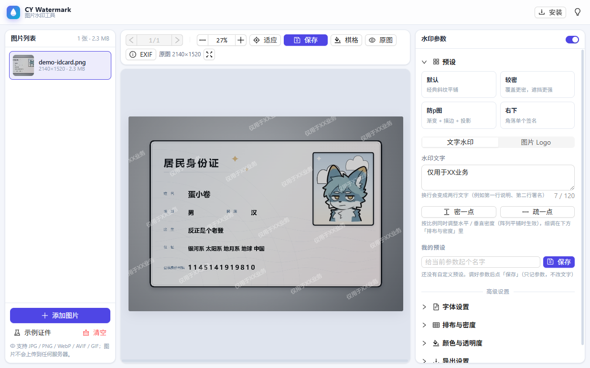
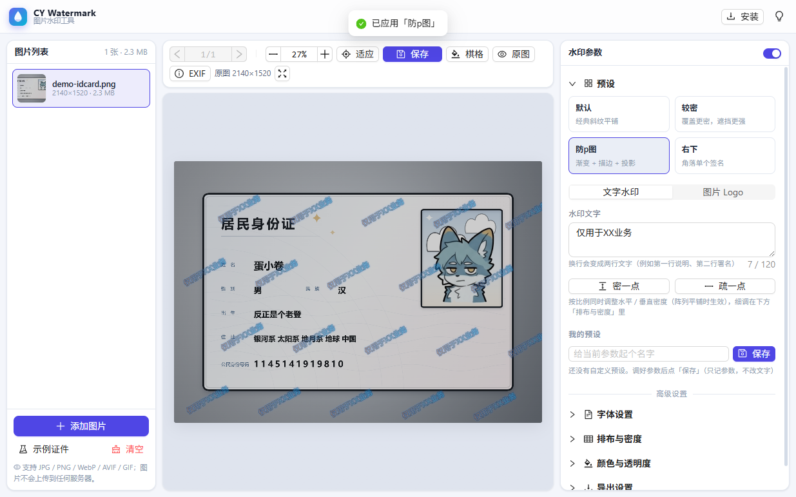
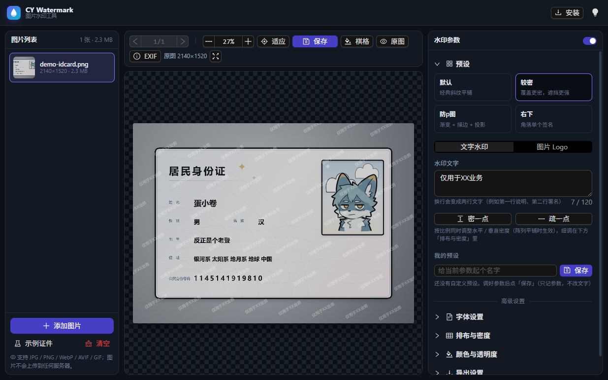

# CY Watermark · 图片水印工具

纯前端、**完全在浏览器本地运行**的图片批量加水印工具。

- 🔒 **不上传** —— 图片不进任何服务器，没有后端、没有埋点
- 🎛️ **参数全可调** —— 角度 / 密度 / 颜色 / 渐变 / 描边 / 投影 / 透明度
- ⚡ **一键成片** —— 4 套内置预设（默认 / 较密 / 防p图 / 右下），点一下就有专业效果
- 🧹 **顺手护隐私** —— 默认抹除 EXIF（机型 / 拍摄时间 / GPS 定位）
- 📦 **批量处理** —— 多图自动打包 ZIP，也能逐个下载或一键复制到剪贴板
- 📱 **可安装** —— 作为 PWA 装到桌面，断网也能正常用

而且全都是本地处理，不会等待任何网络请求。

[](docs/screenshot-1.png)

| 预设「防p图」：渐变 + 描边 + 投影 | 深色模式 + 大密度平铺 |
| --- | --- |
| [](docs/screenshot-2.png) | [](docs/screenshot-3.png) |

> 技术栈：Vue 3 + Vite + Ant Design Vue + 原生 CSS

---

## ✨ 功能

### 核心

| 功能 | 说明 |
| --- | --- |
| 多图导入 | 一次选择多张、整页拖拽、`Ctrl+V` 粘贴，支持 JPG / PNG / WebP / AVIF / GIF |
| 实时预览 | 参数一改立刻重绘；支持缩放（5%~800%）、适应窗口、拖拽平移、全屏预览 |
| 阵列平铺 | 倾斜角度、水平密度、垂直密度、隔行错位、位置抖动、角度抖动 |
| 单个位置 | 九宫格定位 + 边距 + 任意旋转角度 |
| 文字水印 | 多行文字、字体、字号、加粗 / 斜体、字间距 |
| 图片水印 | 上传透明 PNG Logo（如品牌标），可调宽度 |
| 颜色 | 纯色 / 线性渐变（渐变方向角 + 快捷配色） |
| 透明度 | 0~100% 独立控制，防盗图常用 20%~40% |
| 描边 / 投影 | 让水印在复杂背景上依旧清晰 |
| EXIF 抹除 | **默认抹除全部元数据**（机型、拍摄时间、GPS 等）；也可选择保留 |
| 导出 | JPG / PNG / WebP，画质可调、最长边限制、文件名模板；多图自动打包 ZIP |

### 额外实用功能

- **预设系统**：内置 4 套模板（默认 / 较密 / 防p图 / 右下），点一下即套用；也可以把当前参数存成「我的预设」（只记参数，不动水印文字）
- **导出入口**：预览区工具栏的「保存」下拉，可选择保存当前图片 / 打包 ZIP / 逐个下载 / 复制到剪贴板
- **参数自动记忆**：所有设置存在 localStorage，下次打开即恢复
- **EXIF 查看器**：解析并展示厂商、机型、镜头、快门、光圈、ISO、焦距，甚至 GPS 坐标（自动转十进制度）
- **复制到剪贴板**：一键以 PNG 形式复制带水印的图片，直接粘贴到聊天窗口 / 设计软件
- **深色模式**：跟随手动切换，偏好持久化
- **快捷键**：`Ctrl/⌘+S` 导出当前、`←` `→` 切换图片、`I` 查看 EXIF
- **按住看原图**：对比水印前后效果
- **示例证件**：一键生成一张程序绘制的卡通「虚拟身份证」，不用找素材就能试效果
- **响应式**：窄屏时左右面板自动变成抽屉，手机上也能用

### 隐私

所有解码、绘制、编码都在你的浏览器里完成，没有任何后端、没有埋点、不发起任何图片上传请求。

---

## 🚀 本地开发

```bash
npm install        # 安装依赖
npm run gen:icons  # 生成 PWA 图标（首次需要，仓库已包含生成结果）
npm run dev        # 开发服务器 http://localhost:5173
npm run build      # 生产构建 → dist/
npm run preview    # 本地预览构建结果
```

> 首次 `npm install` 后如果缺少 `package-lock.json`，请把 `.github/workflows/deploy.yml`
> 里的 `npm ci` 改成 `npm install`，或把 lock 文件一起提交（推荐）。

---

## 📦 发布到 GitHub Pages

### 已经为你配置好的部分（声明式配置）

| 文件 | 作用 |
| --- | --- |
| `.github/workflows/deploy.yml` | GitHub Actions 工作流：push 到 `main` 后自动构建并部署 |
| `vite.config.js` | 自动推导 `base`：从 Actions 注入的 `GITHUB_REPOSITORY` 判断是项目页还是用户页 |
| `public/.nojekyll` | 阻止 Jekyll 处理，避免 `_` 开头的资源 404 |
| `vite-plugin-pwa` | 自动生成 `manifest.webmanifest` + Service Worker，实现离线安装 |

### 你需要在 GitHub 上做的一次性设置

1. 新建仓库并把代码推上去（分支名用 `main`）：

   ```bash
   git init
   git add .
   git commit -m "feat: 图片批量加水印工具"
   git branch -M main
   git remote add origin https://github.com/<你的用户名>/<仓库名>.git
   git push -u origin main
   ```

2. 打开仓库 **Settings → Pages**，把 **Build and deployment → Source** 改成 **GitHub Actions**。
   （这一步是必须的；不设置的话 `actions/deploy-pages` 会报 `Get Pages site failed`。）

3. 回到仓库 **Actions** 标签页，等待 `Deploy to GitHub Pages` 跑完（约 1 分钟）。
   工作流里也会执行一次 `configure-pages`，通常会自动把 Source 设置好。

4. 访问 `https://<你的用户名>.github.io/<仓库名>/`。

### 关于 `base` 路径

`vite.config.js` 里的逻辑：

```js
const repoName = process.env.GITHUB_REPOSITORY?.split('/')[1]
const base = repoName && !repoName.endsWith('.github.io') ? `/${repoName}/` : '/'
```

- 仓库名是普通项目名（如 `cy-watermark`）→ `base = /cy-watermark/`，页面地址 `https://user.github.io/cy-watermark/`
- 仓库名是 `<用户名>.github.io` → `base = /`，页面地址 `https://user.github.io/`
- 本地 `npm run dev` / `npm run preview` → `base = /`

如果部署到自定义域名或子路径，也可以显式指定：

```bash
# 任意 CI 环境
cross-env GITHUB_REPOSITORY=owner/repo npm run build
# 或直接在 vite.config.js 里写死 base: '/your-path/'
```

### 其他平台

- **Netlify / Vercel**：Build command `npm run build`，Publish directory `dist`，无需额外配置（`base` 会自动是 `/`）。
- **Cloudflare Pages**：同上。

---

## 📲 安装到桌面（离线使用）

构建产物是一个标准 PWA：

- **Chrome / Edge（桌面 & Android）**：地址栏右侧会出现「安装」图标，或从浏览器菜单选「安装应用」。
  页面右上角也提供了「安装」按钮，可直接触发安装弹窗。
- **iOS Safari**：点底部「分享」→「添加到主屏幕」。iOS 不支持自动安装弹窗，页面会给出提示。
- 安装后通过 Service Worker 缓存全部静态资源，**断网也能打开并正常处理图片**。

> 提示：Service Worker 只在生产构建（`dist/`）或 HTTPS / localhost 下生效。

---

## 🧱 项目结构

```
cy-watermark/
├─ .github/workflows/deploy.yml   # Pages 自动部署
├─ scripts/gen-icons.mjs          # 零依赖生成 PWA 图标（自写 PNG 编码器）
├─ docs/                          # README 用的截图
├─ public/                        # favicon / PWA 图标 / samples（示例证件人像）/ .nojekyll
├─ src/
│  ├─ main.js
│  ├─ App.vue                     # 布局、主题、全局拖拽、快捷键
│  ├─ config/defaults.js          # 默认参数、字体列表、内置模板
│  ├─ stores/                     # settings / images / logo（模块级响应式单例）
│  ├─ components/
│  │  ├─ AppHeader.vue
│  │  ├─ ImagePanel.vue           # 左侧图片列表
│  │  ├─ PreviewStage.vue         # 中间画布（缩放 / 平移 / 对比 / 全屏）
│  │  ├─ SettingsPanel.vue        # 右侧参数面板（预设 + 高级设置）
│  │  ├─ ExifModal.vue
│  │  ├─ base/                    # SliderRow / FieldRow / ColorField
│  │  └─ panels/                  # 预设 / 字体 / 排布 / 颜色 / 导出
│  └─ utils/
│     ├─ watermark.js             # ★ 水印绘制核心（旋转坐标系点阵布点）
│     ├─ exif.js                  # EXIF 提取 / 回填 / 解析 / 方向归正
│     ├─ exporter.js              # 渲染 → 编码 → ZIP / 下载
│     ├─ image.js                 # 解码 / 缩略图 / 下载
│     ├─ sample.js                # ★ 程序绘制的「虚拟证件」示例图
│     ├─ format.js, math.js, picker.js
│     └─ ...
```

### 绘制算法要点

1. **相对尺寸**：字号按「图片宽度的百分比」计算，所以预览（缩到 2048px 以内）与导出（原始分辨率）结果完全一致。
2. **旋转坐标系布点**：先把画布绕中心旋转到目标角度，在旋转后的坐标系里铺规则网格，
   再把每个点逆变换回图片坐标绘制。这样无论角度是多少，水印之间的水平 / 垂直间距都保持均匀。
3. **确定性随机**：抖动使用 `mulberry32` 固定种子，拖动任何滑块都不会让水印"乱跳"；
   点「换一批随机分布」才会换种子。
4. **EXIF 方向归正**：解码时用 `createImageBitmap(file, { imageOrientation: 'from-image' })`，
   像素已摆正；保留 EXIF 时会把 `Orientation` 标签改写为 1，避免看图软件二次旋转。

---

## ⌨️ 快捷键

| 按键 | 功能 |
| --- | --- |
| `Ctrl / ⌘ + S` | 导出当前图片 |
| `←` / `→` | 上一张 / 下一张 |
| `I` | 查看当前图片的 EXIF |
| `Ctrl / ⌘ + 滚轮` | 画布缩放 |
| `Ctrl + V` | 粘贴剪贴板里的图片 |

---

## 📄 License

MIT

## 特别鸣谢

- 大肥鱼（deepseek）
- Copilot